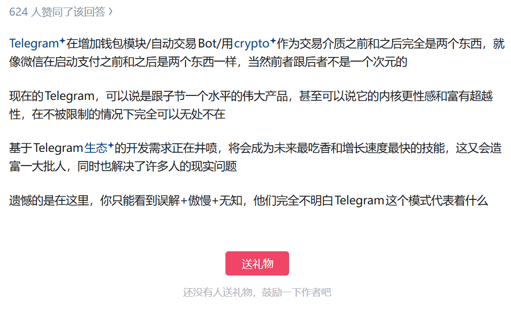

我最重要的东西: 精力.

## 1. 我的信条
* __乐观__: 和我经历过最多曲折的信念;
* __谦逊__: 裸奔时代与中国人情世故中, 保护自己的最佳方式;
* __深度专注__: Grothendieck, Durov, Faker 式人格魅力.

**我的座右铭**: __痛苦是一种对灵魂的清洗.__

**心之所向**: [**一个人的气质, 是靠自己硬生生闯出来的, 一个饱经风霜, 经历过暴风雨洗礼的人, 才能压得住场子, 遇到问题才会极其淡定, 才能有一种独特的韵味和魅力, 这些都不是学来的, 而是在大风大浪中磨练出来的, 只有经历困难, 才能历练一个人的淡定和从容, 当你内心强大了, 自然就会显得有气质.**](https://www.bilibili.com/video/BV1hPhSzQEMy/?share_source=copy_web&vd_source=fa770b2848370154ff797b0ece7eae1b)

Gemini 启示:
1. 对 Durov 禁欲观点的提炼 -- 简单的快乐 (Easy Pleasure) 会削弱你追求困难事物的意志力.

## 2. 核心竞争力

## 3. 核心弱势
过度计划 -- 从本科科研一事无成, 到研究生科研后半段一事无成, 再到高中毕业7年未打造出核心竞争力, 都是过度计划导致的.

## 4. 目标
### 20251015 - 20261015 目标 (附进度)

* (1) 精力 -- 13:10 午休 & 23:45 睡觉 & 全天社交媒体使用时间小于 30 mins 的日子有:
    - 202511**, 

* (2) 钱 -- 攒 200,000 人民币: 0

* (3) 博客 -- 
    - Leetcode 博客:
    - nanochat 博客:
    - Deep Research 博客: 
    - MTProto 博客: 

* (4) 阅读 -- 
    - 动物庄园
    - 1984
    - 美丽新世界
    - 通往奴役之路

* (5) 音乐 -- 
    - 吉他: 

### 目标拆分 (如何完成)
* Leetcode 博客打算怎么写? 每天在自己电脑本地更新3个题目的完整解法, 提交到 blog.v 仓库的 LEETCODE.ipynb 里, 标题加粗同时附上链接, 写明方法, 时间复杂度, 空间复杂度三项, 并将运行结果打印出来.
* Deep Research 博客怎么写? 解读 node-DeepResearch, 自己的 DR4LTG (此项不开源), Anthropic Deep Research, OpenAI Deep Research, Tongyi Deep Research, ASearcher 等项目的博客或论文, 并把解读和链接一节一节地更新到 DeepResearch.md 中.
* Telegram 博客怎么写? 记录 how to build my own telegram by TDLib from scratch, 重点记录实现方式和代码架构, 同时可以记录一些 MTProto 相关的加密理论, 同时记录自己对于 Bot 的探索, 最终目标是做出我自己的 Bot, 超级账号, Telev (我自己的 Telegram).

* nanochat 博客怎么写? 计划固定一些参数, 来写一个完全可复现项目的博客.
* ETH 回头再说.

学业内目标: 
1. 20251031: 完成力扣前 100 题, 以所有题目思路与解法的博客为最终产物;
2. 20260201: 完成一篇 Deep Research 博客;
3. 20260301 (粗略估计): 完成一篇关于 Deep Research 的顶会论文, 目标 2026 出国汇报一次;
学业外目标:
1. 20260501: 完成一篇关于 nanochat 的博客;
2. 20260601: 完成一篇关于 TDLib 的博客, 拥有自己的频道, 并搭建自己的 Deep Research Bot.

## 5. 愤世嫉俗
你觉得公务员'水', 你觉得普通博士'垃圾', 你愤世嫉俗, 你看不起没有真正价值的, 那么你有多么'脱俗'? 请用行动证明你自己:

20251027 - 20251102

## 6. 研读收藏夹
1. https://core.telegram.org/mtproto
2. https://thinkingmachines.ai/blog/
3. https://github.com/karpathy/nanochat
4. https://tongyi-agent.github.io/publication/
5. https://ethereum.org/zh/developers/docs/

## 前车之鉴
1. [Durov 博客](https://www.bilibili.com/video/BV1mzHLztEnp/?share_source=copy_web&vd_source=fa770b2848370154ff797b0ece7eae1b)
2. [Perplexity 创始人采访: 你不需要为整个市场下赌注, 你只需要 do what you truly are obsessed about (33:27)](https://www.bilibili.com/video/BV19pnnzSEj8/?share_source=copy_web&vd_source=fa770b2848370154ff797b0ece7eae1b)
3. [Shunyu Yao 离开物理, 加入 AI](https://alfredyao.github.io/posts/2025-10-06.html)
4. [杨振宁分享自己的故事](https://www.bilibili.com/video/BV196WszvEVu/?spm_id_from=333.1007.tianma.1-1-1.click&vd_source=d925ec444f980704d6cc1c68facf3aad)

