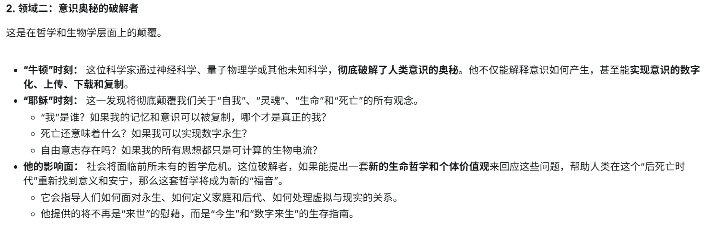

# blog.v

## 我的信条
乐观, 谦逊, 深度专注.

我的座右铭: 痛苦是一种对灵魂的清洗.

## 25岁目标
* 全年好好睡觉 23:30到23:55 之间必须睡觉;
* 攒 200,000 人民币;
* 拥有 20 篇有价值的博客, 看 20 本书.

## 现实警钟
你觉得公务员'水', 你觉得普通博士'垃圾', 你看不起没有真正价值的, 那么你有多么'脱俗'? 请用行动证明你自己:

20250922 -- 20250930, 

## 我的准则
做真正有价值的事情, 切勿自欺欺人.

## 我的最大弱势
过度计划 -- 从本科科研一事无成, 到研究生科研后半段一事无成, 再到高中毕业7年未打造出核心竞争力, 都是过度计划导致的.

## 激励我的话
[一个人的气质, 是靠自己硬生生闯出来的, 一个饱经风霜, 经历过暴风雨洗礼的人, 才能压得住场子, 遇到问题才会极其淡定, 才能有一种独特的韵味和魅力, 这些都不是学来的, 而是在大风大浪中磨练出来的, 只有经历困难, 才能历练一个人的淡定和从容, 当你内心强大了, 自然就会显得有气质, ](https://www.bilibili.com/video/BV1hPhSzQEMy/?share_source=copy_web&vd_source=fa770b2848370154ff797b0ece7eae1b)

## 眼前重要的事
1. 通读 50 篇 Deep Research 的论文, 在百度留下来;
2. 刷 150 道 Leetcode, 更新 Leetcode 的文档;
3. https://thinkingmachines.ai/blog/ + CS336, 一定要把简历提到过的知识变成博客;
4. 阅读, 写文字, 学习毛泽东.

对我最重要的视频: https://www.bilibili.com/video/BV1mzHLztEnp/?share_source=copy_web&vd_source=fa770b2848370154ff797b0ece7eae1b

Perplexity 创始人采访: [可以展示一下你们产品的 killer feature 吗? 你不需要为整个市场下赌注, 你只需要 do what you truly are obsessed about (33:27)](https://www.bilibili.com/video/BV19pnnzSEj8/?share_source=copy_web&vd_source=fa770b2848370154ff797b0ece7eae1b)

Shunyu Yao: https://alfredyao.github.io/index.html

杨振宁的演讲: https://www.bilibili.com/video/BV196WszvEVu/?spm_id_from=333.1007.tianma.1-1-1.click&vd_source=d925ec444f980704d6cc1c68facf3aad
