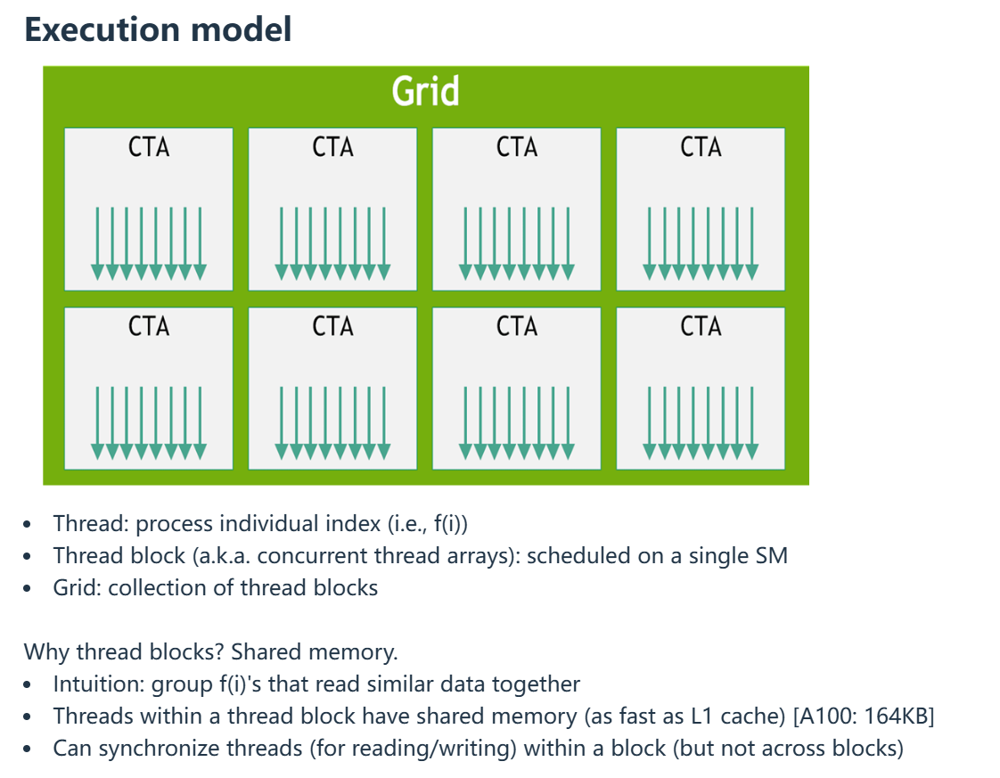

# CS336: Language Modeling from Scratch

## 基本概念

* **FLOPS (Floating Point Operations per Second)**: 每秒浮点运算次数 (Floating Point Operations Per Second), 用于衡量计算设备的持续浮点计算能力 -- 1 FLOPS = 1 次浮点运算/秒, NVIDIA A100 GPU 的峰值性能为 19.5 TFLOPS (指无 Tensor Core 与 FP16 / BF16 加持的情形).
* **FLOP/s (Floating Point Operations)**: 浮点运算总数 (Floating Point Operations), 不带时间单位, 表示任务的总计算量. 用于衡量算法或模型的复杂度, ResNet-50 inference 一张图 / backprop 一个 batch 约需要 3.8 × 10⁹ FLOP (38亿次浮点运算)

## Kernels, Triton

* Coalescing (内存合并访问): GPU 编程中最重要的性能概念之一, 也是 "如何避免 Memory Bound" 的核心技巧. 简单来说, Coalescing 是指 GPU 的内存控制器将同一个 Warp (32个线程) 发出的多个内存请求, "合并" 成尽可能少的内存事务 (Transactions) 的过程.

Memory 举例:
* DRAM [A100: 80GB] - big, slow 
* L2 cache [A100: 40MB]
* L1 cache [A100: 192KB per SM] - small, fast

{#fig:executionmodel}

@fig:executionmodel 是 CUDA 的编程模型, 是写代码时脑子里的逻辑结构.
* **Grid**: 对应你的每一次 Kernel Launch (比如 `kernel<<<grid, block>>>(...)`). 它代表了整个计算任务. 比如你要在这个 Grid 里把两个大矩阵相乘.  
* **CTA (Concurrent Thread Array, 并发线程阵列)**: 这就是我们常说的 **Thread Block (线程块)**. "CTA" 是硬件和底层架构文档里的术语, "Block" 是 CUDA 编程时的术语, 它们是同一个东西. 一个 CTA (Block) 里的所有线程是可以互相协作的 (通过 Shared Memory 通信, 同步).  
* **Thread**: 线程是最小的执行单位. 每个 Thread 处理一个数据点 (比如 f(i)). 在硬件上, 线程不是一个一个跑的, 而是每 32 个组成一组 (叫 Warp) 一起跑的 (SIMT 模型).

* **PCI Express 4.0 Host Interface**: GPU 和 CPU (Host) 通信的桥梁. 当你用 tensor.to('cuda') 时, 数据就是通过这条路从 CPU 内存搬到 GPU 显存的.  
* **GigaThread Engine with MIG Control**: 这是 GPU 的总指挥官/调度器. 它负责接收你发出的 Grid, 然后把里面的 CTA (Block) 分配给各个 SM 去干活. MIG (Multi-Instance GPU): A100 的特技. 它可以把这一大块芯片在物理上切割成最多 7 个独立的小 GPU 给不同的人用.  
* **GPC (Graphics Processing Cluster)**: GPU 内部的层级结构. 一个 GPU 包含多个 GPC (A100 有 8 个). 它是包含多个 TPC 的容器.  
* **TPC (Texture Processing Cluster)**: GPC 下面的层级. 一个 TPC 通常包含 2 个 SM.  
* **SM (Streaming Multiprocessor)**: 核心中的核心. 一个 CTA (Block) 一旦开始执行, 就会被锁死在一个 SM 上, 直到执行结束.  
* **L2 Cache**: 所有 SM 共享的缓存. SM 如果在自己的 L1 找不到数据, 就会来 L2 找. 它也是连接 SM 和 HBM 的中间站.  
* **Memory Controller**: 内存控制器. 负责指挥数据的进出.  
* **HBM2 (High Bandwidth Memory 2)**: 大家常说的 "显存" (比如 A100 的 40GB 或 80GB). 它的特点是带宽巨大 (High Bandwidth). 你的模型权重、KV Cache 全都存在这里.  
* **High-Speed Hub & NVLink**: 如果你有 8 张 A100, 它们之间不走 PCIe, 而是走 NVLink 互联. 极高带宽的 GPU-GPU 通信, 也是大模型训练能 Scale up 的关键.

{#fig:ga100sm}

对 @fig:ga100sm 中每一个元素的详细解释:
* **L1 Instruction Cache & L0 Instruction Cache**: 存放指令 (代码) 的地方. SM 需要知道下一步该做什么操作 (加法? 乘法?).  
* **Warp Scheduler & Dispatch Unit (32 thread/clk)**: 起包工头的角色. 虽然一个 Block 分配到了 SM, 但 SM 不是一次性把 Block 里所有线程都跑完. 它是按 Warp (32 个线程) 为单位调度的. Scheduler 挑选一个这就绪的 Warp, Dispatch Unit 把它发射给计算单元.  
* **Register File (16,384 x 32-bit)**: 寄存器堆. 这是 GPU 上最快的存储空间. 作用: 每个线程私有的 "背包". 我们的 CUDA kernel 里定义的局部变量 (float x = ...) 就存在这里. 如果寄存器不够用, 就会发生 "Register Spill" (溢出到慢速内存), 导致性能骤降.  
* **Tensor Core**: 张量核心. 专门为 AI 设计的暴力计算单元. 它不做普通的加减法, 它只做一件事: 矩阵乘法 ($D = A \times B + C$). 它可以一个指令周期完成大矩阵的乘法. LLM 性能提升主要靠它.  
* **INT32 / FP32 / FP64**: CUDA Core. 传统的计算单元. 分别处理整数, 单精度浮点, 双精度浮点运算.  
* **LD/ST (Load/Store Units)**: 专门负责从内存读数据 (Load) 和写数据 (Store). 它们计算地址并执行读写.  
* **SFU (Special Function Unit)**: 专门算难算的数学函数, 比如 sin, cos, log, exp, sqrt. 它们的数量比普通 Core 少, 所以算这些函数比较慢.  
* **192KB L1 Data Cache / Shared Memory**: **SRAM (静态随机存取存储器)**. 这是最需要强调的部分! 在 A100 上, L1 Cache (硬件自动管理) 和 Shared Memory (程序员手动管理) 共用 这 192KB 的物理硬件. 如果把这个部分看作是车间, 那么数据就是从 HBM (仓库) 搬到这里, 才能被 Tensor Core 快速使用 (这是 Tiling 技术的核心).  
* **Tex (Texture Unit)**: 纹理单元. 它是图形渲染时代的遗留物, 但在计算中依然有用. 它负责处理一些特殊的内存访问模式 (如边界采样) 和数据解压.

* **GPU SRAM (Static Random Access Memory)**: 对应硬件: SM 里面的 Register File 和 L1 Cache / Shared Memory. 特点: 极快 (19TB/s), 极小 (20MB 总量). 数据必须到了这里, Tensor Core 才能计算.  
* **GPU HBM (High Bandwidth Memory)**: 对应硬件: A100 芯片旁边的黑色 HBM2 颗粒. 特点: 很快 (1.5 - 2.0 TB/s), 较大 (40GB / 80GB). 它就是 "Global Memory". 我们的 PyTorch Tensor (x.cuda()) 默认就在这里. LLM 推理和训练的瓶颈通常在于把数据从 HBM 搬到 SRAM 的速度 (Memory Wall).  
* **Main Memory (CPU DRAM)**: 对应硬件: 插在服务器主板上, 供 Host CPU 使用的系统内存条, 容量: 在 A100 服务器上通常是 1TB - 2TB. 它很慢 (12.8 - 100 GB/s), 巨大 (>1TB). 解释: 当 GPU 显存不够时 (OOM), 我们可以把参数卸载 (Offload) 到这里. 但因为它通过 PCIe 传输, 速度太慢, 会严重拖累训练速度.

### PyTorch Profiler 性能指标术语表

| 字段名 (Metric) | 定义 (Definition) | 性能分析含义 (Significance) |
| :--- | :--- | :--- |
| **Name** | **算子名称** | 对应 PyTorch 内部的 ATen 算子名 (aten::*) 或 CUDA Kernel 函数签名. |
| **Self CPU** | **Host 端自身耗时** | 该算子在 CPU 线程当前的**栈帧 (Stack Frame)** 内实际执行指令的时间, **不包含**其调用的子算子 (Callees) 的时间. 通常包含参数校验, Kernel Launch 开销及逻辑控制. |
| **Self CPU %** | **Host 端自身耗时占比** | `Self CPU` 时间占整个 Profiling 周期内总 CPU 时间的百分比. |
| **CPU Total** | **Host 端总耗时** | 该算子从入栈到出栈的完整**挂钟时间 (Wall-clock time)**, **包含**其自身逻辑以及所有子算子 (Callees) 的执行时间. |
| **CPU Total %** | **Host 端总耗时占比** | `CPU Total` 时间占整个 Profiling 周期内总 CPU 时间的百分比. |
| **CPU Time Avg** | **Host 端平均调用耗时** | `CPU Total` / `# of Calls`. 反映该算子在 Host 端的平均派发 (Dispatch) 开销. |
| **Self CUDA** | **Device 端自身耗时** | 该算子对应的 GPU Kernel 在设备端实际执行计算的时间. 由于 Kernel 通常是叶子节点 (Leaf Node), 此数值直接反映该算子在 GPU 上的计算/访存开销. **这是性能瓶颈分析的核心指标.** |
| **Self CUDA %** | **Device 端自身耗时占比** | `Self CUDA` 时间占整个 Profiling 周期内 GPU 总活跃时间的百分比. |
| **CUDA Total** | **Device 端总耗时** | 该算子及其触发的所有底层 GPU Kernel 的执行总时间. |
| **CUDA Time Avg** | **Device 端平均执行耗时** | `CUDA Total` / `# of Calls`. 反映该算子在 GPU 上的平均计算/访存负载. |
| **# of Calls** | **调用频次** | 该算子在 Profiling 采样区间内被调用的总次数. |

> * **Total (Inclusive Time)**: 包含当前函数及其调用栈深度方向上所有子函数的累积时间.
> * **Self (Exclusive Time)**: 仅统计当前函数栈帧内的执行时间. 计算公式为: $T_{self} = T_{total} - \sum T_{callees}$.
> * **CPU 时间**: 发生在 Host 端, 主要包括 Python 解释器开销, PyTorch 动态图构建, 以及向 GPU **提交 (Enqueue/Launch)** 任务的开销. 由于 CUDA API 是异步的, CPU 完成提交后会立即返回, 不等待 GPU 计算结束.
> * **CUDA 时间**: 发生在 Device 端. 是 GPU Stream 实际上处理数据的时间.
    * *注: 如果 CPU Total 远大于 CUDA Total, 通常意味着**系统处于 CPU-Bound 状态** (GPU 在等 CPU 发指令); 反之则是 **GPU-Bound** (正常的深度学习训练状态).*